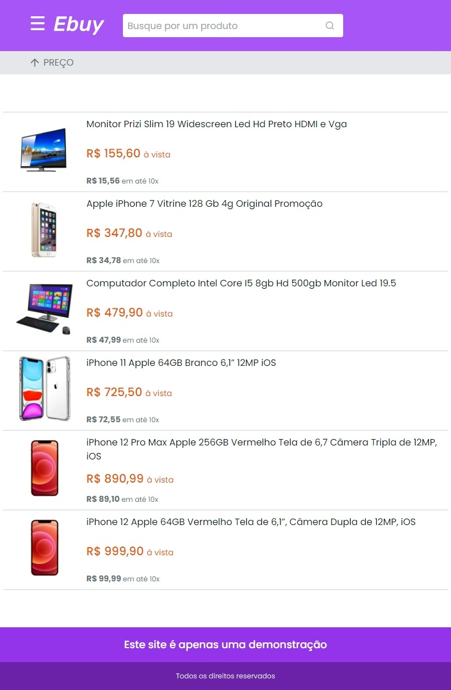

<h1 align="center">
  
  Ebuy
</h1>

   

  

  

     

  

## Tecnologias utilizadas
Esse projeto foi desenvolvido com as seguintes tecnologias:

- [Next](https://nextjs.org/)

## Licença
Esse projeto está sob a licença MIT. Veja o arquivo [license](license) para mais detalhes.

Criado com 💜 por [lhmoreno](https://github.com/lhmoreno)
